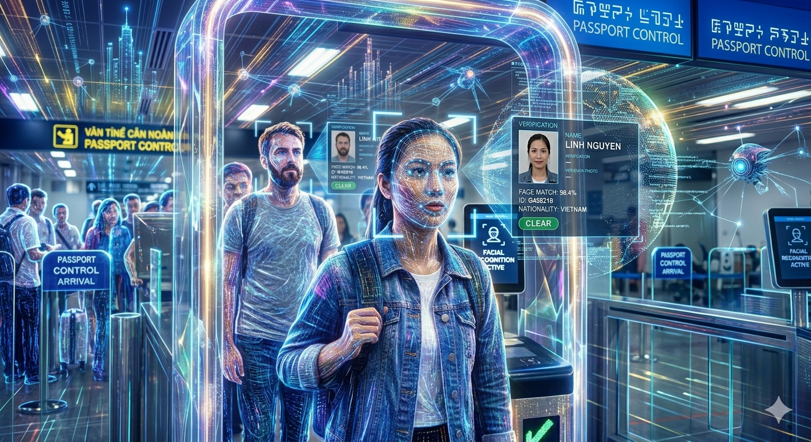

# FACE REGCONITION WITH ARTIFICAL INTELLIGENCE

Need to install the following dependencies to run the code:
1. torch
2. torchvision
3. mediapipe
4. opencv-python
5. numpy
6. Pillow
7. timm
8. python 3.12 (version này dùng không bị lỗi - có thể sẽ lỗi ở các version cũ hơn)

## Quy trình đăng ký: Nhận vào 1 ảnh + ID người dùng để đặt làm tên folder lưu trữ
1. Mediapipe kiểm tra ảnh có khuôn mặt hợp lệ không -> Không thì trả về app cho chụp lại
2. Nếu hợp lệ, crop ảnh và trích xuất đặc trưng bằng EdgeFace
3. Trả về folder chứa ảnh khuôn mặt.jpg + đặc trưng.npy dùng cho so sánh sau này - gửi tới database lưu trữ

## Quy trình nhận dạng: Nhận vào 1 ảnh
1. Mediapipe kiểm tra ảnh có khuôn mặt hợp lệ không -> Không thì trả về app cho chụp lại
2. Anti-spoofing kiểm tra ảnh có phải là ảnh chụp người thật không -> Không thì trả về app cho chụp lại
3. Nếu hợp lệ, crop ảnh và trích xuất đặc trưng bằng EdgeFace
4. Databse bên ngoài nhận kết quả, tiến hành so sánh với đặc trưng.npy đã lưu để xác định danh tính (dùng order by/cosine similartiy/ ...)
5. Thông tin người giống nhất sẽ được gửi từ database tới app để hiển thị

### Lưu ý : Người dùng phải hoàn tất đăng ký cho có dữ liệu lưu trữ để so sánh trước khi tiến hành định danh.

Bản chính thức là regconition.py + subcrise.py. Regco_demo là thử nghiệm so sánh với internal database là folder face_database. Chính thức thì regconition.py (nếu ảnh hợp lệ) chỉ thực hiện extract feature và gửi file.npy tới database để bên đó thực hiện so sánh.

Folder users chỉ để chứa ảnh test, face_database và feature extracted tương tự. Có thể không cần dùng.

Nếu muốn test thì up ảnh lên và test thôi !

### Absoluately "DO NOT CONDUCT ANY CHANGE" in the following folders : anti_spoofing, edgeface, face_landmark
